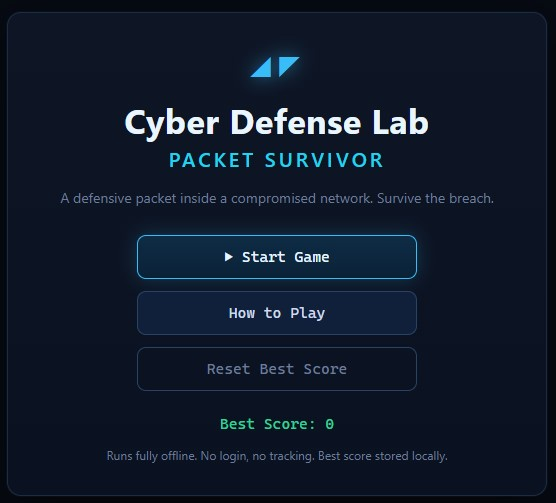
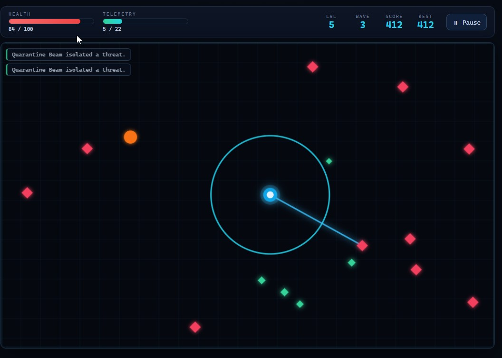
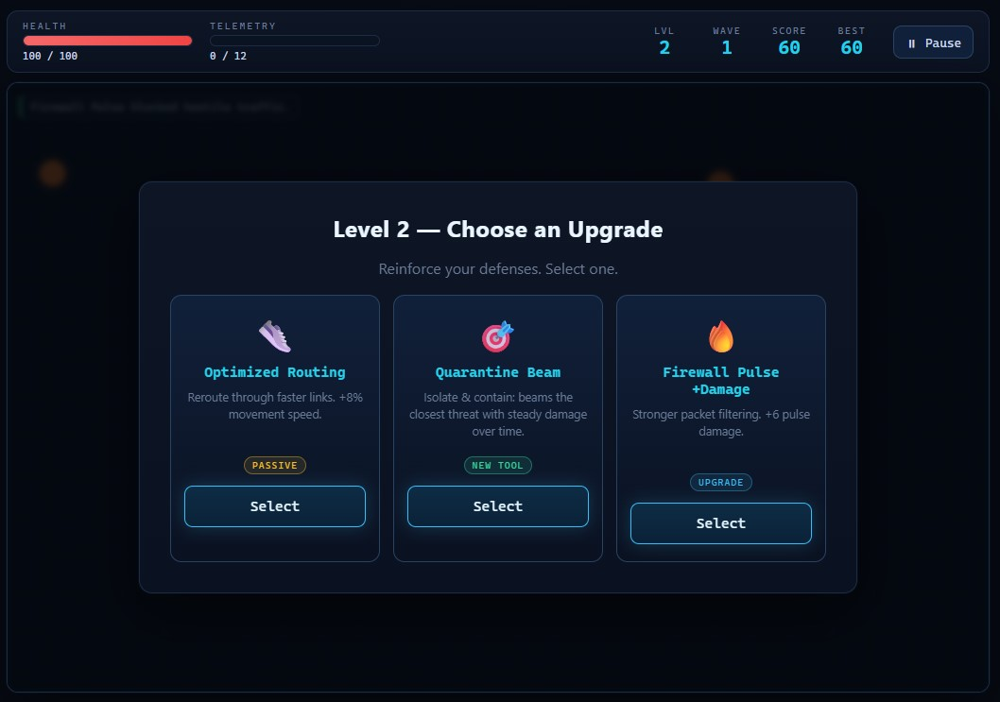
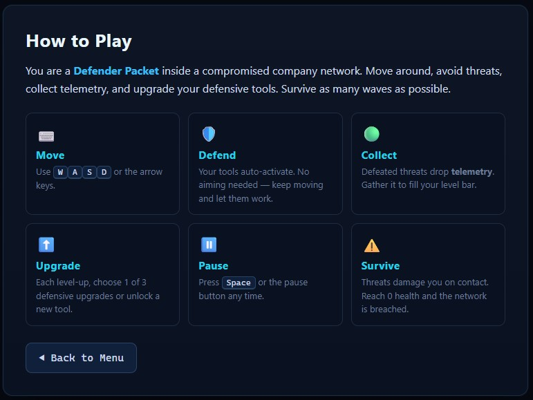

# Cyber Defense Lab Packet Survivor

A top-down arena **survival** game with a defensive cybersecurity theme. You play
a **Defender Packet** inside a compromised company network — survive waves of
abstract cyber threats, collect telemetry, and upgrade your defensive tools for as
long as you can hold the line.

Built with **plain HTML, CSS, and JavaScript**. No backend, no API, no login, no
database, no accounts, no tracking, **no build step**. It runs by simply opening
`index.html`, and deploys to **GitHub Pages** as-is.

> 🧠 **It's a game, not a quiz.** There are no questions, answers, or exam-style
> content. You absorb real defensive-security concepts — firewall, EDR, SIEM, DNS
> sinkhole, MFA, honeypot, quarantine, backups — through the names, descriptions,
> and behaviour of your tools and the threats you face.

## Live Demo

Play the game here:

https://lohetapja.github.io/Packet-Survivor/

## Screenshots

### Main Menu



### Gameplay



### Upgrade Selection



### How to Play



## Features

- 🎮 Top-down arena survival with smooth WASD / arrow-key movement
- 🎚️ Three **difficulty modes** — Training, Analyst, Incident Commander
- 🌊 Seven distinct threat types introduced one wave at a time
- 🧰 **22 damage abilities** that **auto-activate** — pulses, projectiles, rings, orbits, beams, fields, companions, mines & walls
- 🎯 **Choose your starter**, then build a **loadout of up to 6** tools — with visible damage / cooldown numbers on every card
- 🧬 High **build variety** — every run combines different archetypes
- ⬆️ Level-up chooser with **type and rarity** badges (New Tool / Upgrade / Passive · Common / Uncommon / Rare)
- 🛰️ **SOC Hub** home base — a progress dashboard linking Tool Library, Threat Intel Database, Achievements, Lab Room & Incident Archive
- 🔓 **Persistent unlocks** — earn 15 more tools through play, plus **14 achievements** and a **50-item Cyber Defense Lab Room**
- 📅 **Daily Simulations** — a 7-day cyber-ops rotation with unique modifiers (no backend; uses your local day of week)
- ✨ Lightweight game feel: hit flashes, death bursts, telemetry pops, damage flash, screen shake
- 📚 In-game **Threat Intel** and **Defensive Tools** guides — learn through play, no quiz
- 📈 Difficulty scaling: easy early waves, genuinely stressful mid waves
- 🧾 Post-run **incident report** — threats contained, telemetry, most effective defense, highest-risk threat, per-type breakdown, and a defensive recommendation
- 💾 All progress saved locally in `localStorage` — **no backend, no login, no tracking**
- 🎛️ Pause / Resume / Restart / Main Menu flow
- 🌑 Dark SOC-dashboard aesthetic, responsive layout

## Controls

| Action | Keys |
| ------ | ---- |
| Move   | `W` `A` `S` `D` or arrow keys |
| Pause / Resume | `Spacebar` (or the on-screen buttons) |

At the start of a run you **choose your first damage tool** from three options.
Defeated threats drop **telemetry**; collect it to level up and pick a new tool or
an upgrade — up to a loadout of **6 tools**. No mouse aiming — all tools auto-target.
Every 24 seconds a harder wave begins; at 0 health the network is breached and you
get an incident report.

## Difficulty Modes

Pick a mode on the main menu before starting. It's a simple set of multipliers (in
`src/js/config.js`) on threat health, speed, contact damage, scaling rate, and spawn
pace. Your choice is shown on the HUD and in the incident report.

| Mode | Feel |
| ---- | ---- |
| **Training** | Forgiving — gentler threats, slower scaling. Learn the ropes. |
| **Analyst** | Balanced — the standard experience. |
| **Incident Commander** | Relentless — tougher threats, faster scaling, constant pressure. |

The **How to Play** screen also includes **Threat Intel** and **Defensive Tools**
panels: a short, defensive, no-quiz explainer for every threat and tool.

## Progression & SOC Hub

Every run feeds a local progression save (`localStorage`, key
`packetSurvivorSave`). The **SOC Hub** (from the main menu) is your home base:

- **Tool Library** — collection view of all 22 tools with locked/unlocked status,
  stats, role, and unlock conditions.
- **Threat Intel Database** — every threat you've discovered, with danger rating,
  times contained, damage caused, and recommended defenses.
- **Achievements** — 14 milestones with progress bars.
- **Cyber Defense Lab Room** — 50 unlockable items (SOC Desk, Wall Board, Tool
  Cabinet, Threat Intel, Trophies) that fill in as you play.
- **Incident Archive** — your last 10 run reports.

**Unlocks** add *variety, not raw power*: you start with 7 damage tools and earn
the other 15 by reaching waves, containing threats, and collecting telemetry.
Locked tools never appear in the starting choice or level-up pool until unlocked.

**Daily Simulations** rotate by real-world day of week (entirely offline) — e.g.
*Patch Tuesday* (more malware, Patch Wave buffed), *Backup Drill* (more ransomware,
Backup Restore stronger), *Threat Hunt* (fewer, stronger beacons). A briefing shows
the modifiers before you start; completions are tracked locally.

Use **Reset Progress** on the menu to wipe the save (it asks for confirmation first).

## Defensive Tools

**22 auto-activating damage abilities**, grouped by archetype. You choose one to
start, then add up to six. Each has 2–3 upgrades, and the full list with stats lives
on the in-game **How to Play** screen.

- 🔥 **Pulse** (area) — Firewall Pulse, Patch Wave, NDR Sweep
- 💠 **Radial** (mid) — Packet Storm, SOAR Volley
- ✳️ **Projectile** (mid/long) — EDR Burst, IDS Needle, YARA Strike, Telemetry Lance (pierce)
- 📡 **Ring** (close/area) — SIEM Scanner, Zero Trust Ring
- 🛡️ **Orbit** (close) — MFA Shield, Log Shredder, TLS Shield Arc
- 🎯 **Beam** (long) — Quarantine Beam, Memory Scanner
- 🕸️ **Field / trap** — DNS Sinkhole, DLP Net (vs Exfiltration), Sandbox Trap
- 🚁 **Companion** — Threat Hunter Drone
- 💣 **Mine** — Containment Mine
- 🧱 **Wall** — Network Segmentation Wall

**Passives** (not part of the 6-tool cap): Hardened Core (+max HP), Optimized
Routing (+speed), Telemetry Magnet (+pickup range), Backup Restore (per-wave heal).

## Threat Types

| Threat | Behaviour |
| ------ | --------- |
| 🟠 Malware Blob | Basic; medium speed and health |
| 🔺 Phishing Hook | Fast, fragile; rushes you |
| 🔻 Brute Force Swarm | Weak, but spawns in groups |
| 🟥 Ransomware Cube | Slow, high health, high damage |
| ⬟ Credential Thief | Fast; weaves as it closes in |
| 🟡 Beacon Signal | Small command-and-control activity; appears later |
| ➤ Exfiltration Drone | Fast late-game threat; worth bonus score |

## Run Locally

No server, no install, no build:

1. Download or clone the repository.
2. Double-click **`index.html`** (or open it in any modern browser).

If your browser blocks local scripts, you can optionally serve the folder with any
static server, e.g. `python -m http.server 8000`, then open `http://localhost:8000`.

## Deploy on GitHub Pages

1. Push the files to a GitHub repository.
2. In the repo, go to **Settings → Pages**.
3. Under **Build and deployment**, set **Source** to *Deploy from a branch*, choose
   your branch (e.g. `main`) and the **`/ (root)`** folder.
4. Save. The game goes live at `https://<your-username>.github.io/<your-repo>/`.

No build, bundler, or CI is required — the files are served exactly as they are.

## Tech Details

- **Stack:** vanilla HTML5 Canvas + CSS + JavaScript. No frameworks.
- **No build step:** classic `<script>` tags loaded in dependency order onto a
  single `window.CDL` namespace. This deliberately avoids ES-module `import` (which
  fails under the `file://` protocol), so the game runs both by double-clicking
  `index.html` and on GitHub Pages.
- **Rendering:** one `<canvas>` at a fixed 1000×620 internal resolution, scaled
  responsively with CSS, driven by a single `requestAnimationFrame` loop.
- **Persistence:** a single integer in `localStorage` (`cdl_packet_survivor_best`).
  Nothing else is stored or transmitted.

## Project Structure

```
.
├── index.html                 # markup: menus, HUD, overlays, game-over screen
├── README.md
├── CHANGELOG.md
├── LICENSE
├── src/
│   ├── css/style.css          # dark SOC-dashboard theme
│   └── js/                     # config, storage, save, effects, abilities,
│                               #   enemies, progression, tools, upgrades, waves,
│                               #   player, ui, hub, game (loaded in order)
├── assets/
│   ├── screenshots/           # README screenshots
│   └── icons/                 # optional custom icons (game uses emoji by default)
└── docs/
    ├── GAME_DESIGN.md         # design pillars, mechanics, balance
    ├── ROADMAP.md             # planned / possible future work
    └── DEVELOPMENT_NOTES.md   # architecture & "how to extend" notes
```

## Learning Purpose

This is a **portfolio + educational** project for a Cyber Defense Lab. The goal is
to make core *defensive* security concepts memorable through play: defense in depth,
detection & response (EDR/SIEM), containment & recovery (quarantine, sinkholes,
backups), and identity (MFA). The post-run incident report reinforces a real
defender habit — review what happened, identify the biggest risk, note an improvement.

## Disclaimer

This is an **abstract, defensive, educational** game. It contains **no real malware,
no exploit code, no phishing templates, no credential-theft steps, no hacking
commands, and no attack instructions of any kind.** All "threats" are stylised
geometric shapes and all "tools" are conceptual representations of defensive security
practices. Nothing here can be used to attack a real system.

## License

Released under the [MIT License](LICENSE).
